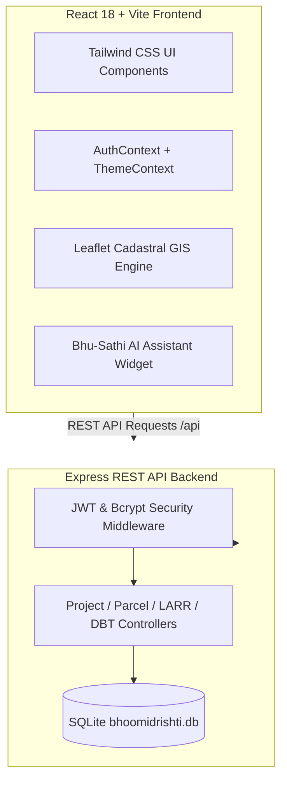

# 🏛️ BhoomiDrishti - National Land Acquisition & Decision Support Platform

[](https://smartindiahackathon.gov.in)
[](LICENSE)
[](https://reactjs.org)
[](https://tailwindcss.com)
[](https://expressjs.com)
[](https://sqlite.org)
[](https://vercel.com)

> **Tagline:** *"Visioning Transparent, Real-Time & Equitable Land Governance for India's Infrastructure"*  
> **Problem Statements:** **SIH26016** & **SIH26017** (Ministry of Rural Development / MoRTH / NHAI)

---

## 📌 Executive Summary

**BhoomiDrishti** is a centralized, AI-driven national platform designed to digitize, monitor, and accelerate India's land acquisition lifecycle under the **RFCTLARR Act 2013** (Right to Fair Compensation and Transparency in Land Acquisition, Resettlement and Rehabilitation Act).

The platform bridges the gap between Central Ministries, Special Land Acquisition Officers (SLAO), Field Cadastral Surveyors, and Displaced Citizens, ensuring **100% statutory transparency, automated solatium calculation, DGPS GIS boundary verification, direct benefit transfers (DBT via PFMS), and AI risk mitigation**.

---

## 🌟 Core Modules & Statutory Workflows

### 1. 🏛️ Central Ministry Command Center (MoRD / NHAI)
- **National Executive Dashboard:** Real-time monitoring of land parcels, acquired acreage, DBT funds disbursed, and active Section 3C objections across 36 States/UTs.
- **Cascading Hierarchy Filters:** Filter by State, District, Sector, Project Corridor, Revenue Village, and ULPIN (Bhu-Aadhaar).

### 2. ⚖️ SLAO Workbench & 11-Stage LARR 2013 Workflow Engine
- **Statutory Workflow Tracking:** Standardized 11-stage pipeline from Social Impact Assessment (SIA) to Section 3A Notice, Section 3D Declaration, Section 3G Award, and Revenue Mutation.
- **Automated Solatium & Multiplier Calculator:** Computes 100% Solatium, Rural Factor (1.2x - 2.0x), 12% additional interest per annum, and structural/tree assets valuation.
- **Section 3G Award Dossier:** One-click generation and printing of official Section 3G Award Dossiers with digital signatures.

### 3. 🛰️ GIS Cadastral Studio & DGPS Field Survey
- **Interactive Spatial Layers:** Leaflet map integration with OpenStreetMap, High-Res Satellite Aerial imagery, Clean Light, and Topographic layers.
- **Boundary Demarcation Engine:** DGPS coordinate verification comparing revenue record area against field surveyed polygons to identify boundary discrepancies.

### 4. 👤 Citizen & Affected Landowner Transparency Portal
- **Bhu-Aadhaar (ULPIN) Verification:** Instant verification of land records by ULPIN (`27-14-9021-M8H2B1`) or Khasra/Plot number.
- **"What Happens Next?" Decision Support:** Clear guidance on current statutory status, immediate next actions, responsible authority, and timelines.
- **Accessibility Suite:** Screen reader voice audio assist (`📢`), font scaling (`A- A A+`), and Hindi/English language toggle.
- **Objection & Grievances:** Online Section 3C objection filing directly to Collectorate.

### 5. 🤖 Bhu-Sathi AI Assistant & SIH26017 Risk Radar
- **Floating AI Assistant:** Interactive chat assistant trained on RFCTLARR 2013 legal provisions, Section 3G formulas, and procedural guidelines.
- **Litigation Risk Analytics:** Predictive risk scoring (0-100) identifying high-risk land parcels prone to court stay orders.

---

## 🏗️ Technical Architecture



---

## 💻 Tech Stack

| Layer | Technology |
|---|---|
| **Frontend UI** | React 18, Vite, Tailwind CSS, Lucide Icons, Recharts |
| **GIS Mapping** | Leaflet.js, React-Leaflet, OpenStreetMap, Satellite Tiles |
| **Backend API** | Node.js, Express.js, JWT, Bcrypt |
| **Database** | SQLite3 (`bhoomidrishti.db`) with auto-seeding & migrations |
| **Deployment** | Vercel (Serverless Functions + Static Build) |

---

## 🚀 Local Installation & Setup

### Prerequisites
- **Node.js:** v18.0.0 or higher
- **Git:** Installed on system

### 1. Clone Repository
```bash
git clone https://github.com/YOUR_USERNAME/BhoomiDrishti.git
cd BhoomiDrishti
```

### 2. Install Dependencies & Run
Using the auto-launcher script on Windows:
```cmd
start_all.bat
```

Or manually:

```bash
# Terminal 1: Start Backend API (Port 5000)
cd server
npm install
npm start

# Terminal 2: Start Frontend App (Port 3000)
cd client
npm install
npm run dev
```

- **Frontend Application:** `http://localhost:3000`
- **Backend API:** `http://localhost:5000/api`

---

## 🔐 Authorized Demo Credentials

| Role | Email | Password | Primary Workspace |
|---|---|---|---|
| **Central Ministry Admin** | `admin@bhoomidrishti.gov.in` | `admin123` | National Command Dashboard (`/`) |
| **SLAO Officer (District)** | `slao@bhoomidrishti.gov.in` | `slao123` | 11-Stage LARR Workflow (`/workflow`) |
| **Field Surveyor (DGPS)** | `surveyor@bhoomidrishti.gov.in` | `survey123` | GIS Cadastral Studio (`/gis`) |
| **Citizen Landowner** | `landowner@bhoomidrishti.gov.in` | `owner123` | Citizen Portal (`/citizen`) |

---

## 🌐 Live Vercel Deployment

This repository includes `vercel.json` and `api/index.js` for 1-click Vercel deployment.

```text
🔗 Live Demo URL: https://bhoomidrishti.vercel.app
```

---

## 📄 License

Distributed under the **MIT License**. See `LICENSE` for details.

Developed for **Smart India Hackathon (SIH 2026)**.
